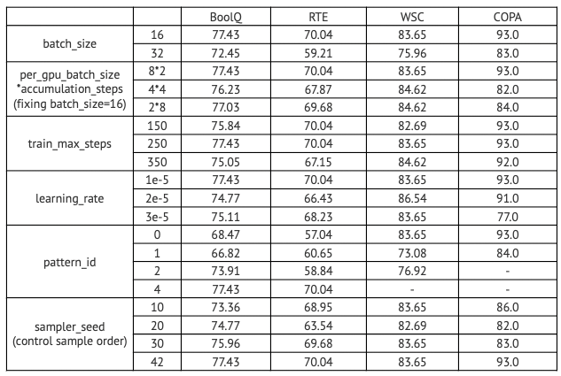

# FewNLU

FewNLU is a systematic few-shot learning package for natural language understanding (NLU) tasks, which integrates commonly-used tasks and advanced few-shot learning methods.
FewNLU supports:
1. A more reasonable few-shot setting which uses a 32-sample dev set to perform model and hyper-param selection.
2. Different types of formalization for few-shot learning tasks, including standard sequence classification form, 
   cloze form with hand-crafted prompts and cloze form with continuous prompts.
3. Multiple advanced methods that could boost the performance of few-shot NLU tasks, for example, P-tuning, self-training, multi-task learning etc.
4. Easy-to-use data interfaces that either access existing few-shot NLU benchmarks or transfer to new datasets.

For more detailed information, please refer to our technical report paper (to be released soon).

## Few-shot under the Updated Setting

### Introduction

Previously, related works assume no development sets and adopt a set of hyper-parameters based on practical consideration.
However, such a "shooting-in-the-dark" setting is not able to provide specific strategies for hyper-param/model selection.
And it might need to make the hyper-param/model selection by referring to the test set repeatedly, where information leaking occurs.

To avoid information leaking and the trap of hyper-param tuning, FewNLU proposes a more reasonable few-shot setting.
First of all, a 32-sample dev set is required.
FewNLU provides 32-sample dev sets for the SuperGLUE few-shot benchmark.

Download: [https://cloud.tsinghua.edu.cn/f/6e9cd075d9024dc3b6db/?dl=1 
](https://cloud.tsinghua.edu.cn/f/6e9cd075d9024dc3b6db/?dl=1 
)

The updated few-shot setting works as follows:
1. Hyper-param selection: 
    - Perform grid search over all hyper-params that would drastically disturb few-shot performance.
    - After grid-searching, take the following two steps to select the best hyper-params.
        + For certain hyper-param configuration (random seed excluded), we evaluate its performance according to the average dev32 performance over multiple random seeds;
        + After selecting the best-performed hyper-param configuration (random seed excluded), we then determine the random seed value by selecting the one with best/median dev32 performance.
    
2. Model selection:
    - During the training process, it is evaluated on the dev32 set every N steps. The checkpoint with the best dev32 performance is finally saved.
    - During training, early stopping is used to avoid overfitting.
    
    
We conduct extensive ablation study on different hyper-params (Table 1) and find that: 
1) Few-shot learning appears highly sensitive to various factors (Some of them does not affect much on fully-supervised learning).
2) Even slight change on a certain factor would drastically affect few-shot performance (e.g., different sample orders cause more than 10 points performance gap on COPA).

<div align="center">



</div>


### Usage

FewNLU provides scripts for few-shot hyper-param grid searching, where key influencing factors are included.
We provide instructions by taking SuperGLUE few-shot benchmark as an example, to show how to perform few-shot grid searching with pre-defined tasks and methods.
1. [Download](https://cloud.tsinghua.edu.cn/f/6e9cd075d9024dc3b6db/?dl=1) the SuperGLUE few-shot (also know as FewGLUE) data.
Set `DATA_DIR` with your local data path. Besides, you may also change `SAVE_PATH` to your local path.
   
   
2. Run the following script (for example, pet method.)
```
bash scripts/run_superglue_pet.sh <task_name> <gpu_id> <model_type>
```
In the scripts, hyper-params to be considered for grid searching have been assigned appropriate search space.
For other base models, methods or tasks, you should specify your own search space.

Key arguments include:
1. To choose among different few-shot methods, one should specify `--method`. Pre-defined methods include 
   standard sequence classification, pet/ipet, ptuning, adapet.
   You can also develop and customize your own new method by implementing a `Model` class. 
   Please refer to [Customizing your Own Methods](#Customizing your Own Methods) for more detailed instructions.
   
2. To choose different tasks/datasets, one should specify `--dataset_name` (e.g., superglue) and `--task_name` (e.g., rte).
You can also apply FewNLU to new NLU tasks. You can customize your own new tasks by 
   simply implementing a `DataProcessor` for loading data and a `PVP` for patternizing data inputs. 
   Please see [Customizing your Own Tasks](#Customizing your Own Tasks) for more detailed instructions.

3. To change your base pretrained models, one should specify `--model_type` (e.g., albert) and 
   `--model_name_or path` (e.g., microsoft/deberta-xxlarge-v2). Currently, FewNLU supports both
   bidirectional language models (e.g., bert-based models) and unidirectional models (e.g., gpt-based models).
   


   

## Customizing your Own Tasks 

To customize your own NLU tasks with FewNLU, you need to create your own dataset repository in [tasks](/tasks
), in which you define multiple tasks. For each task, you should implement a subclass of class `DataProcessor` in
 [/tasks
/base_processor.py
](/tasks/base_processor.py) and a subclass of class `PVP` in [/tasks/base_pvp.py](/tasks/base_pvp.py). Besides, you
 need to
 register your own dataset & tasks by defining `YOUR_METRICS`, `YOUR_PROCESSORS` and `YOUR_PVPS`.
 Here we take the MRPC task in [GLUE](/tasks/glue) dataset as an
  example. 

### 1. Formalizing your Task with Patterns

We first need to design different types of patterns for the MRPC task.
The MRPC task is a paraphrase detection task, each data of which consists of two sentences and a label (`1` for
 paraphrases while `0` for non-paraphrases)
An example data from MRPC train set is as follows.
```
sentence1: Amrozi accused his brother, whom he called "the witness", of deliberately distorting his evidence.
sentence2: Referring to him as only "the witness", Amrozi accused his brother of deliberately distorting his evidence.
label: 1
```
(1) For standard classification fine-tuning, the pattern is designed by simply concatenating both sentences.
```
[sentence1][SEP][sentence2]
```

(2) When fine-tuning with manual discrete prompts, we design the patterns as follows. 
```
Does "[sentence1]" has the same meaning with "[sentence2]"? [MASK].
```
Accordingly, for verbalizers, the pretrained model predicts "Yes" for
 label `1` while "No" for label `0`. 
 
(3) For P-tuning which tunes pretrained models with continuous prompts, we design the patterns as follows.
Based on the designed manual discrete prompt, we insert several continuous prompt words (e.g., here we insert one
) into it.
```
Does "[sentence1]" has the same meaning with "[sentence2]"? [cont_prompt_word] [MASK].
```
For the location of continuous prompt words to be inserted in, several practical tips are as follows.
* test
* test
* test

### 2. Implement subclass of `PVP`

The function of class `PVP` is to formalize inputs into different patterns. For FewNLU three different types of
 formalization strategies are provided for selection, including standard fine-tuning patterns, manual discrete patterns
  and
  continuous patterns (P-tuning).

To implement a subclass of `PVP`, you need to define a new class (e.g., class `MRPCPVP`) by inheriting superclass `PVP`.
Inside the class `MRPCPVP`, you should first specify the `VERBALIZER` variable, which defines the mapping between
 labels to verbalizers. 
Second, you should re-implement the abstract function `get_parts()` that returns a PVPOutputPattern object, such that
 pretrained models take it as inputs.
Third, you should re-implement the abstract function `verbalize()` that returns corresponding verbalizer word given
 a label.
 Take `MRPCPVP` as an example:
 ```rest
class MRPCPVP(PVP):
    VERBALIZER = {
        "1": ["Yes"],
        "0": ["No"]
    }
    def get_parts(self, example: InputExample) -> PVPOutputPattern:
        text_a = self.shortenable(example.text_a)
        text_b = self.shortenable(example.text_b)
        if not self.use_cloze:
            return [text_a], [text_b]
        elif not self.use_continuous_prompt:
            return ["Does ", text_a, " has the same meaning with ", text_b, "? ", [self.mask_id], "."], []
        else:
            return ["Does ", text_a, " has the same meaning with ", text_b, "? ", 1, [self.mask_id], "."], []
           
    def verbalize(self, label) -> List[str]:
        if not self.use_cloze:
            return []
        return MRPCPVP.VERBALIZER[label]
```
Note that `shortenable()` is used to mark that the segments can be truncated when exceeding the maximum sequence
 length. For P-tuning patterns, an integer is used to denote the number of continuous prompt words to be inserted here.

### 3. Implement subclass of `DataProcessor`

The function of class `DataProcessor` is to provides methods for loading training, testing, development/dev32 and
 unlabeled examples for a given task.
 
To implement a subclass of class `DataProcessor`, you need to define a new class (e.g., `MRPCDataProcessor`) by
 inheriting class `DataProcessor`. 
 The new class `MRPCDataProcessor` needs to implement abstract methods `get_labels()` that returns the label list for
  current task, and `_create_examples()` which reads the data file according to its own format.
Here we take the `MRPCDataProcessor` as an example.
```
class MRPCDataProcessor(DataProcessor):
    def get_labels():
        return ["1", "0"]
    
def _create_examples(self, path: str, set_type: str) -> List[InputExample]:
        examples = []
        
        # TODO

        return examples
 
```

### 4. Register your own Dataset & Tasks

After that, you should add dict-type variables `GLUE_METRICS` and `GLUE_PVPS` to [tasks/glue/pvp.py](tasks/glue/pvp
.py), and `GLUEProcessors` to [tasks/glue/processors.py](tasks/glue/processors.py), as follows.
```
GLUE_METRICS = {"mrpc": "acc"}

GLUE_PVPS = {"mrpc": MRPCPVP}

GLUE_PROCESSORS = {"mrpc": MRPCProcessor}
```

### 5. Run your own Experiments

To run experiments on your new tasks with existing methods, based on the given scripts, you should simply replace the
 arguments
 `--dataset` and
 `--task` with your own ones (e.g., `--dataset glue` and `--task mrpc`).
 Besides, you may also need to adjust other dataset-related arguments such as `--max_seq_length` accordingly etc.


## Customizing your own Methods

To customize your own methods with FewNLU, you first need to create your own method repository in [methods](methods
). In sides the repository, you should define a model file, which implements the main parts of your new methods.

  

## Installation

Clone this repo
```shell
git clone https://github.com/THUDM/FewNLU
cd FewNLU
```

To reproduce the exact results as is reported in our technical report paper (to be released soon), please install exact the same version of dependencies by running
```shell
pip install -r requirements.txt
```

If you use FewNLU to perform multiple comparative experiments, 
you are also supposed to keep exact the same environments as well as hardware devices of the same type.
***Several interesting observations (Just FYI, and we will keep updating if got detailed explanations)***  are that:
1. We perform the same experiments (SuperGLUE WSC task) respectively using one A100 GPU and one V100GPU, with the same code, hyper-params as well as exact the same dependencies,
and results vary a lot.
2. The version of Transformers(version 3.0.5 and version 4.5.1) affects differently on few-shot performance.
3. The version of Pytorch CUDA (10.5 and 11.0) affects few-shot performance.


## Acknowledgement

Part of the code is based on [PET](https://github.com/timoschick/pet).
We appreciate all the contributors who made their code public, which greatly advanced few-shot learning as well as this FewNLU project. 
This repository will be continuously updated.
